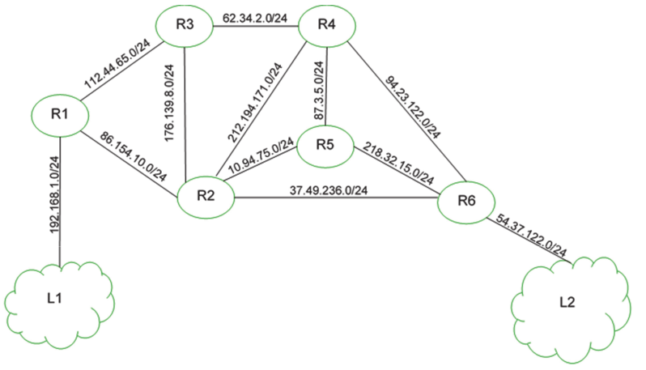
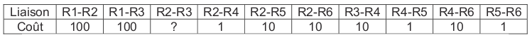

## :octicons-pencil-16: Exercice 1

On considère un réseau composé de plusieurs routeurs reliés de la façon suivante :

1. On suppose que l'on a exécuté le protocole RIP sur ce réseau. Compléter la table suivante, qui indique pour chaque machine la portion de la table de routage pour la destination G.

    | Machine | Destination | Passerelle | Interface | Distance |
    |---------|-------------|------------|-----------|----------|
    | A       | G            |            |           |          |
    | B       | G            |            |           |          |
    | C       | G            |            |           |          |
    | D       | G            |            |           |          |
    | E       | G            |            |           |          |
    | F       | G            |            |           |          |

2. On suppose que le lien B-F tombe en panne. Mettre à jour la table ci-dessus.

--------------------------

## :octicons-pencil-16: Exercice 2

On considère le réseau représenté ci-dessous : 

On utilise le protocole OSPF et on dispose des informations suivantes sur les débits : 

* à l'intérieur du réseau 192.168.0.0/25 : 1,544 Mb/s
* liaison Routeur_1 $\rightarrow$ Switch_1 : 100 Mb/s
* liaison Switch_1 $\rightarrow$ Routeur_2 : 2,048 Mb/s
* liaison Switch_1 $\rightarrow$ Routeur_3 : 100 Mb/s
* liaison Routeur_2 $\rightarrow$ Switch_2 : 1,544 Mb/s
* liaison Switch_3 $\rightarrow$ Routeur_3 et Routeur_4 : 10 Mb/s
* liaison Routeur_4 $\rightarrow$ Internet : 100 Mb/s

Le débit de référénce est de 100 Mb/s.

1. Construire un graphe dont les sommets sont les routeurs et les switchs et les arêtes sont les liaisons. On indiquera sur chaque arête le coût associé.
2. Appliquer l'algorithme de Dijkstra pour trouver le chemin le plus court entre la machine 192.168.0.101 et Internet.

--------------------------

## :octicons-pencil-16: Exercice 3
_2020, sujet 0_

On considère un réseau composé de plusieurs routeurs reliés de la façon suivante :

{: .center width=40%}

Le protocole RIP permet de construire les tables de routage des différents routeurs, en indiquant pour chaque routeur la distance, en nombre de sauts, qui le sépare d’un autre routeur. Pour le réseau ci-dessus, on dispose des tables de routage suivantes :

{: .center width=80%}

**Question 1**

1. Le routeur A doit transmettre un message au routeur G, en effectuant un nombre minimal de
sauts. Déterminer le trajet parcouru.
2. Déterminer une table de routage possible pour le routeur G obtenu à l’aide du protocole RIP.

**Question 2**

Le routeur C tombe en panne. Reconstruire la table de routage du routeur A en suivant le
protocole RIP.

--------------------------

## :octicons-pencil-16: Exercice 4
_2021, sujet Métropole 1_

On représente ci-dessous un réseau dans lequel R1, R2, R3, R4, R5 et R6 sont des
routeurs. Le réseau local L1 est relié au routeur R1 et le réseau local L2 au routeur R6.

{: .center width=70%}

Dans cet exercice, les adresses IP sont composées de 4 octets, soit 32 bits. Elles sont notées X1.X2.X3.X4, où X1, X2, X3 et X4 sont les valeurs des 4 octets, convertis en notation décimale.
La notation X1.X2.X3.X4/n signifie que les n premiers bits de poids forts de l’adresse IP représentent la partie « réseau », les bits suivants représentent la partie « hôte ».
Toutes les adresses des hôtes connectés à un réseau local ont la même partie réseau et peuvent donc communiquer directement. L’adresse IP dont tous les bits de la partie « hôte » sont à 0 est appelée « adresse du réseau ».

On donne également des extraits de la table de routage des routeurs R1 à R5 dans le
tableau suivant :

{: .center width=70%}

1/ Un paquet part du réseau local L1 à destination du réseau local L2.

1.a. En utilisant l’extrait de la table de routage de R1, vers quel routeur R1 envoie-t-il ce paquet : R2 ou R3 ? Justifier.

1.b. A l’aide des extraits de tables de routage ci-dessus, nommer les routeurs traversés par ce paquet, lorsqu’il va du réseau L1 au réseau L2.

2/ La liaison entre R1 et R2 est rompue.

2.a. Sachant que ce réseau utilise le protocole RIP (distance en nombre de sauts), donner l’un des deux chemins possibles que pourra suivre un paquet allant de L1 vers L2.

2.b. Dans les extraits de tables de routage ci-dessus, pour le chemin de la question 2.a, quelle(s) ligne(s) sera (seront) modifiée(s) ?

3/ On a rétabli la liaison entre R1 et R2.
Par ailleurs, pour tenir compte du débit des liaisons, on décide d’utiliser le
protocole OSPF (distance liée au coût minimal des liaisons) pour effectuer le
routage. Le coût des liaisons entre les routeurs est donné par le tableau suivant :

{: .center width=90%}

a. Le coût _C_ d’une liaison est donné ici par la formule
$C = \frac{10^9}{BP}$

où $BP$ est la bande passante de la connexion en bps (bits par seconde).
Sachant que la bande passante de la liaison R2-R3 est de 10 Mbps, calculer le coût correspondant.

b. Déterminer le chemin parcouru par un paquet partant du réseau L1 et arrivant au réseau L2, en utilisant le protocole OSPF.

c. Indiquer pour quel(s) routeur(s) l’extrait de la table de routage sera modifié pour un paquet à destination de L2, avec la métrique OSPF.

--------------------------

## :octicons-pencil-16: Exercice 5
_2021, sujet Métropole 2_

|  | 
|:--:| 
| *Figure 1* |

La figure 1 ci-dessus représente le schéma d’un réseau d’entreprise. Il y figure deux réseaux locaux L1 et L2. Ces deux réseaux locaux sont interconnectés par les routeurs R2, R3, R4 et R5. Le réseau local L1 est constitué des PC portables P1 et P2 connectés à la passerelle R1 par le switch Sw1. Les serveurs S1 et S2 sont connectés à la passerelle R6 par le switch Sw2.

 Le tableau 1 suivant indique les adresses IPv4 des machines constituants le réseau de l’entreprise.

 |   | 
|:--:| 
| *Tableau 1 : adresses IPv4 des machines* |

**Rappels et notations**

Rappelons qu’une adresse IP est composée de 4 octets, soit 32 bits. Elle est notée
X1.X2.X3.X4, où X1, X2, X3 et X4 sont les valeurs des 4 octets. Dans le tableau 1, les valeurs des 4 octets ont été converties en notation décimale.

La notation X1.X2.X3.X4/n signifie que les n premiers bits de poids forts de l’adresse IP représentent la partie « réseau », les bits suivants de poids faibles représentent la partie « machine ».

Toutes les adresses des machines connectées à un réseau local ont la même partie réseau.
L’adresse IP dont tous les bits de la partie « machine » sont à 0 est appelée « adresse du réseau ».
L’adresse IP dont tous les bits de la partie « machine » sont à 1 est appelée « adresse de diffusion ».

1/ 
1.a. Quelles sont les adresses des réseaux locaux L1 et L2 ?

1.b. Donner la plus petite et la plus grande adresse IP valides pouvant être attribuées à un ordinateur portable ou un serveur sur chacun des réseaux L1 et L2 sachant que l’adresse du réseau et l’adresse de diffusion ne peuvent pas être attribuées à une machine.

1.c. Combien de machines peut-on connecter au maximum à chacun des réseaux locaux L1
et L2 ? 

2/ 
2.a. Expliquer l’utilité d’avoir plusieurs chemins possibles reliant les réseaux L1 et L2.

2.b. Quel est le chemin le plus court en nombre de sauts pour relier R1 et R6 ? Donner le nombre de sauts de ce chemin et préciser les routeurs utilisés.

2.c. La bande passante d’une liaison Ether (quantité d’information qui peut être transmise en bits/s) est de $10^7$ bits/s et celle d’une liaison FastEther est de $10^8$ bits/s. Le coût d’une liaison est défini par $\frac{10^8}{d}$ , où $d$ est sa bande passante en bits/s.

 |   | 
|:--:| 
| *Tableau 2 : type des liaisons entre les routeurs* |

Quel est le chemin reliant R1 et R6 qui a le plus petit coût ? Donner le coût de ce chemin et préciser les routeurs utilisés.

3/ Dans l’annexe A figurent les tables de routages des routeurs R1, R2, R5 et R6 au
démarrage du réseau. Indiquer sur votre copie ce qui doit figurer dans les lignes laissées vides des tables de routage des routeurs R5 et R6 pour que les échanges entre les ordinateurs des réseaux L1 et L2 se fassent en empruntant le chemin le plus court en nombre de sauts.

----------------

## :octicons-pencil-16: Exercice 6
_2021, sujet Amérique du Nord_

Un constructeur automobile possède six sites de production qui échangent des documents entre eux. Les sites de production sont reliés entre eux par six routeurs A, B, C, D, E et F.  
On donne ci-dessous les tables de routage des routeurs A à F obtenues avec le protocole RIP.

{: .center}

1. Déterminer à l'aide de ces tables le chemin emprunté par un paquet de données envoyé du routeur A vers le routeur F.
2. On veut représenter schématiquement le réseau de routeur à partir des tables de routage. 
Recopier sur la copie le schéma ci-dessous : 

{: .center}

En s'appuyant sur les tables de routage, tracer les liaisons entre les routeurs.

-----------------------

## :octicons-pencil-16: Exercice 7
_2023, sujet 0a_

Nous allons étudier les communications entre Bob et Alice. Ils communiquent au travers du réseau ci-dessous dont le protocole de routage est le protocole OSPF qui minimise le coût des communications :

||
|:--:|
|*Figure 1 : Plan du réseau de communication entre Alice et Bob.*|

LAN : réseau local ; WAN : réseau étendu ; R : routeur ; Sw : Switch

Une adresse IPv4 est composée de quatre octets soit 32 bits. Une adresse de sous-
réseau avec la notation `/n` signifie que les `n` premiers bits de l’adresse correspondent
à la partie « réseau » et les suivants à la partie « machine ».

L’adresse dont tous les bits de la partie « machine » sont à 0 est appelée adresse du
réseau.

L’adresse dont tous les bits de la partie « machine » sont à 1 est appelée adresse de
diffusion.

Ces adresses sont réservées et ne peuvent pas être attribuées à des machines.
Le choix des routes empruntées par les paquets IP est uniquement basé sur le
protocole OSPF. On prendra comme débit maximal de référence 10 000 Mbit/s.

Le cout est alors calculé de la façon suivante :

$$\text{coût} = \frac{\text{débit maximal de référence}}{\text{débit du réseau concerné}}$$

1. La configuration IP partielle ci-dessous a été affichée sur l’un des ordinateurs :

    `IP hôte : 172.16.2.3`

    `IP passerelle : 172.16.2.253`

    Indiquer en justifiant si cette configuration appartient à l’ordinateur de Bob ou d’Alice.

2. Le réseau WAN8 a un débit de 1 000 Mbit/s. Calculer le cout correspondant.
3. On donne les tables de routage des routeurs R1 à R5, dans lesquelles Pass. désigne la passerelle (qui correspond au routeur suivant) :

    ||
    |:-----:|
    |*Figure 2 : Tables de routage des routeurs R1 à R5.*|

    Écrire sur votre copie la table de routage du routeur R6.

4. Bob envoie un message à Alice.

    Énumérer dans l’ordre tous les routeurs par lesquels transitera ce message.
    
5. Un routeur tombe en panne, le nouveau coût pour la route entre Bob et Alice est de 111. Déterminer le nom du routeur en panne.

-----------------------

## :octicons-pencil-16: Exercice 8
_2023, sujet 0b_

On considère le réseau ci-dessous dans lequel :

* les nœuds A, B, C, D, E, F et G sont des routeurs,
* le type de liaison est précisé entre chaque routeur.

On rappelle que la bande passante des liaisons FTTH (fibre optique : Fiber To The
Home) est de 10 Gbit/s et celle des liaisons FastEthernet de 100 Mbit/s.

On s’intéresse au protocole de routage OSPF. Le protocole OSPF est un protocole de
routage qui cherche à minimiser la somme des coûts des liaisons entre les routeurs
empruntés par un paquet. Le coût $\mathcal{C}$ d’une liaison est donné par :

$$\mathcal{C}=\frac{10^8}{d}$$

où d est la bande passante en bit/s de la liaison.

1. Calculer le coût d’une liaison de communication par la technologie FastEthernet.
2. Le fichier `collections_timbres.csv` contenu dans une machine reliée au routeur A doit être envoyé à une machine reliée au routeur G. Déterminer la route permettant de relier le routeur A au routeur G et minimisant la somme des coûts selon le protocole OSPF.
